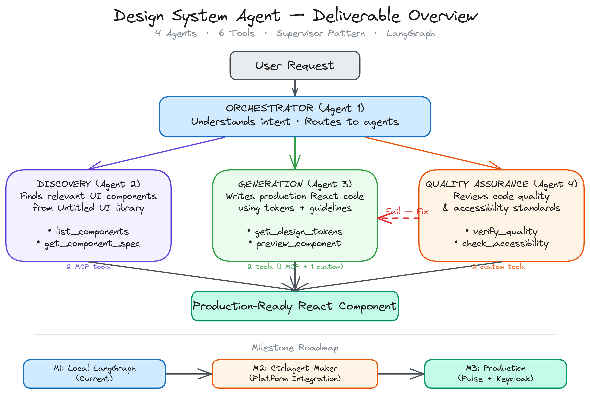

# Milestone 1 — Design System Agent

Multi-agent system that generates production-quality React/JSX UI components from natural language prompts, using the **Untitled UI** design system.

Built with **LangGraph** (4 agents) + **Claude Sonnet** (code gen) + **GPT-4o-mini** (classify/discover/chat) + **RAG** (design system knowledge).

)

---

## Architecture

### 4-Agent Pipeline

```
User Prompt → Pre-Classify (GPT-4o-mini)
                    ↓
    ┌───────────────────────────────────┐
    │         LangGraph Pipeline        │
    │                                   │
    │  Classify → Discovery → Generator │
    │               (GPT-4o-mini)  (Claude Sonnet)
    │                        ↓          │
    │                   QA Reviewer     │
    │                  (rule-based)     │
    │                   ↓      ↓        │
    │                PASS    FAIL       │
    │                 ↓    (retry ×2)   │
    │              Respond              │
    └───────────────────────────────────┘
                    ↓
            Chat UI (SSE stream)
```

| Agent | Model | Role | Speed |
|-------|-------|------|-------|
| **Orchestrator** | GPT-4o-mini (skipped if pre-classified) | Classifies request, routes to sub-agents, manages QA retry loop | ~0-1s |
| **Discovery** | GPT-4o-mini | Single LLM call with pre-loaded catalog, returns Tailwind patterns | ~1-2s |
| **Generator** | Claude Sonnet | Single LLM call, writes complete React/JSX with Untitled UI patterns | ~10-15s |
| **QA Reviewer** | Rule-based (no LLM) | `verify_quality` + `check_accessibility` scoring checks | ~0.1s |

### 6 Tools

| Tool | Purpose |
|------|---------|
| `list_components` | Lists all 24 components from catalog.json |
| `get_component_spec` | Gets full spec + Tailwind patterns for one component |
| `get_design_tokens` | Gets colors, typography, spacing, shadows from tokens.json |
| `preview_component` | Saves code as preview.html (React+Babel+Tailwind sandbox) |
| `verify_quality` | Rule-based: PascalCase, Tailwind, no imports, Untitled UI compliance |
| `check_accessibility` | Rule-based: semantic HTML, aria-labels, focus states, contrast |

### RAG System

- **56 chunks** indexed from catalog.json, tokens.json, and documentation
- **OpenAI text-embedding-3-small** embeddings with disk cache
- Injected into chat responses and discovery for design system context

### Excalidraw Diagrams

Architecture diagrams in `docs/`:
- `discovery-agent-architecture.excalidraw` — Discovery Agent internal flow
- `generator-agent-architecture.excalidraw` — Generator Agent internal flow
- `deliverable-overview.excalidraw` — Full system overview

---

## Tech Stack

| Layer | Technology |
|-------|-----------|
| Code Generation | **Claude Sonnet** (`claude-sonnet-4-20250514`) via Anthropic SDK |
| Classify / Chat / Discovery | **GPT-4o-mini** via OpenAI SDK |
| Embeddings | **OpenAI text-embedding-3-small** |
| Agent Framework | **LangGraph** + LangChain |
| Backend | Python 3, `http.server` + `ThreadingMixIn` |
| Frontend | React 18 (CDN), Babel standalone, marked.js + highlight.js |
| Preview | iframe: React + Babel + Tailwind CDN with Untitled UI config |
| Design Data | `catalog.json` (24 components) + `tokens.json` (full palette) |

---

## Quick Start

### 1. Clone & Install

```bash
git clone https://github.com/ADITYAANAND0707/milestone1-agent.git
cd milestone1-agent
pip install -r requirements.txt
```

### 2. Configure API Keys

```bash
cp .env.example .env
```

Edit `.env`:

```
OPENAI_API_KEY=sk-proj-...
ANTHROPIC_API_KEY=sk-ant-...
USE_LANGGRAPH=true
```

- **`OPENAI_API_KEY`** — Required. Used for: embeddings (RAG), classification, discovery, chat
- **`ANTHROPIC_API_KEY`** — Required for Claude code gen. Falls back to GPT-4o if missing or out of credits

### 3. Run

```bash
cd chatbot
python server.py
```


### Windows: Kill old processes before restart

```powershell
netstat -ano | Select-String ":3851"
taskkill /F /PID <pid>
```

---

## Project Structure

```
milestone1-agent/
├── agent/                    # Multi-Agent System (LangGraph)
│   ├── orchestrator.py       #   Agent 1: Supervisor StateGraph
│   ├── discovery.py          #   Agent 2: Component discovery (GPT-4o-mini)
│   ├── generator.py          #   Agent 3: Code generation (Claude Sonnet)
│   ├── reviewer.py           #   Agent 4: QA review prompt
│   ├── tools.py              #   All 6 tools
│   ├── rag.py                #   RAG: vector index over design system
│   └── server.py             #   Async SSE streaming
│
├── chatbot/                  # Frontend — ChatGPT-style Agent UI
│   ├── server.py             #   HTTP server (port 3851), smart routing
│   ├── index.html            #   Shell: React/Babel/marked/hljs CDN
│   ├── app.jsx               #   React app with ThinkingBar + AgentPipeline
│   └── styles.css            #   Dark theme + pipeline visualization
│
├── design_system/            # Shared design data
│   ├── catalog.json          #   24 components with Tailwind patterns
│   └── tokens.json           #   Untitled UI palette, typography, shadows
│
├── docs/                     # Architecture diagrams
├── coding_guidelines.md      #   Injected into Generator prompt
├── PROJECT_CONTEXT.md        #   Full project context for AI agents
└── requirements.txt
```

---

## Features

- **Natural language → production React/JSX** — describe any UI, get complete runnable code
- **Untitled UI design system** — 24 components, exact Tailwind patterns baked into generator prompt
- **Live preview** — inline iframe with React 18 + Tailwind CDN, viewport switcher (desktop/tablet/mobile)
- **Cursor-style thinking bar** — collapsible bar shows discovery/generation output, keeps chat clean
- **Real-time pipeline visualization** — 5-node pipeline (Classify → Discovery → Generate → QA → Respond) with live status
- **QA with auto-retry** — rule-based quality + accessibility checks, auto-regenerates on failure (max 2 retries)
- **Variant generation** — ask for 2-3 style variants, get side-by-side previews
- **Conversation memory** — localStorage persistence, history truncation to save tokens
- **Smart routing** — pre-classification skips redundant LLM call (~2s saved per request)
- **Auto-fallback** — Claude → GPT-4o fallback if Anthropic key is missing or has billing issues

---

## Pipeline Flows

```
"generate" →  Pre-classify → [Classify(skip) → Discovery → Generation → QA → Respond]
"discover" →  Pre-classify → [Classify(skip) → Discovery → Respond]
"review"   →  Pre-classify → [Classify(skip) → QA → Respond]
"chat"     →  Pre-classify → Direct GPT-4o-mini + RAG (no pipeline)
```

---

## Design System

### 24 Components

Button, Input, Badge, Avatar, Card, Table, Tabs, Modal, Select, Checkbox, EmptyState, StatsCard, SearchInput, ProgressBar, Toggle, Radio, Textarea, Dropdown, Tooltip, Tag, Pagination, FileUpload, LoadingIndicator, Notification

### Tokens (Untitled UI)

- **9 color families** — primary/blue, gray, success/emerald, error/red, warning/amber, purple, indigo, rose (shades 25-900)
- **Typography** — Inter font, 8 sizes, 4 weights
- **Shadows** — 5 levels (xs-xl) with Untitled UI values
- **Border radius** — 7 values (none-full)

---

## License

MIT
